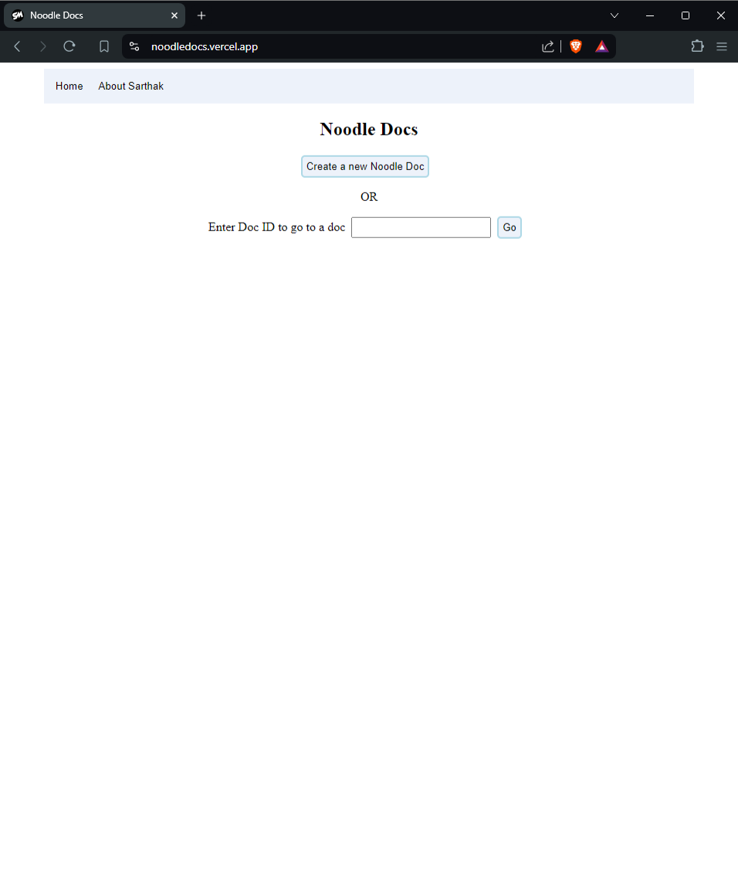
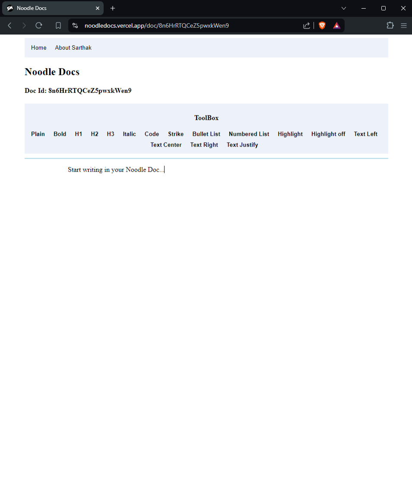
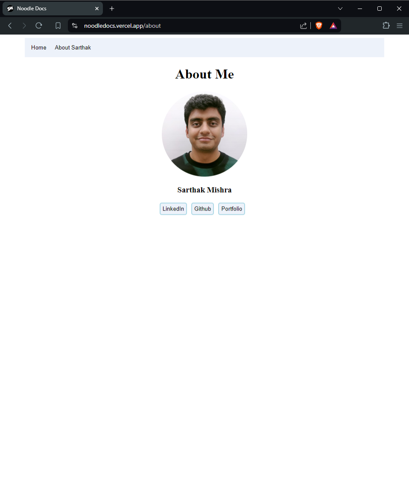

# Noodle Docs

Noodle Docs is a Google Docs clone that allows users to create and edit documents in real-time. Users can either create a new document or enter the ID of an existing document to collaborate with others.

## Key Features
- **Create New Document**: Easily create a new document which is assigned a unique document ID.
- **Collaborative Editing**: Multiple users can work on the same document simultaneously with real-time updates.
- **Document Access by ID**: Enter the ID of an existing document to continue editing or collaborating.
- **Real-time Synchronization**: Changes are instantly reflected for all users working on the same document.

## Short Description
Noodle Docs is designed to provide a seamless collaborative document editing experience, similar to Google Docs. The home page allows users to either create a new document, which generates a unique document ID, or enter the ID of an existing document to continue editing. Real-time collaboration is powered by Socket.io, ensuring that changes are synchronized instantly across all users.

## Snippets

<h3>Noodle Docs Home</h3>

<h3>Noodle Docs New Doc</h3>

<h3>Noodle Docs About</h3>

## Tech Used
### Frontend
- **React.js**
- **TypeScript**

### Backend
- **Express**
- **Socket.io**

### Deployment
- **Frontend**: Deployed on Vercel
- **Backend**: Deployed on Render

## How to Use

1. Clone the repository: `git clone https://github.com/sarthakmishraa/noodle-docs.git`

Feel free to clone the repository and explore the project. Contributions are welcome!

## Contributing
Contributions are welcome! Please fork the repository and submit a pull request.